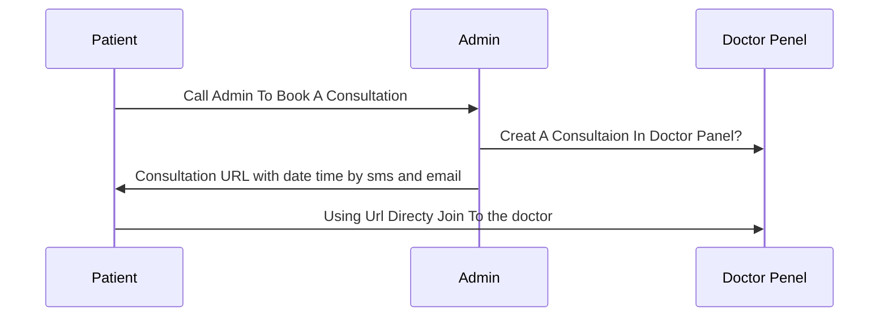

# About us

# Welcome to Talk2Doc!

**Talk2Doc, is a complete consultation platform. With Talk2Doc patients can get their consultation sitting at home, with video and audio calls. Not just taking consultations but also they will be able to receive their prescriptions and share the reports of the medical tests with the doctors. Also, all the Doctors will be able to track all the medical history of a patient and many more**

With many more exciting and useful features, we offer you the complete consultation platform because we believe **“Your wellbeing is our commitment”**

## UML diagrams

This is how our system is working now. [Book your consultation ](https://talk2doc.xyz/) and get a consultaion url to get started.

## Build With

**Programming language**

**Frameworks and Libraries**

 
 
 
 
 
**Run Time Environment**

**Database**

 
 
**Deployment And Server Side Technologies**

 
 
 
  
   

**Version control and collaboration**

**Tools**

 

## Technical Stack

We use microservices architecture:

| Service      | Technology                                       |
| ------------ | ------------------------------------------------ |
| API          | `'Node','Nest JS','DB: PostgreSQL', 'Socket.io'` |
| Admin Panel  | `'Angular'`                                      |
| Doctor Panel | `'Angular','Socket.io', 'WebRTC'`                |

## Contact for question or to get access to the code

   
